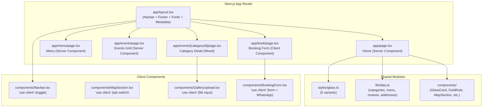

# Design Document: Next.js Glassmorphism Redesign

## Overview

This design describes the migration of the Pasumarthi Banquet Hall website from a Vite + React single-page application (client-side routing via state) to a Next.js 14+ App Router project with server-side rendering, file-based routing, and image optimization. The glassmorphism design language already present in the existing app is formalized into a reusable utility system applied consistently across all pages.

The redesign preserves all existing content, branding, data, and functionality while gaining:
- SEO benefits from SSR and metadata API
- Performance improvements from automatic image optimization (next/image)
- Better code organization via file-based routing and server/client component split
- Maintainability through a centralized glassmorphism style system

**Key Design Decisions:**
1. **Static data stays in-code** — no database or CMS. All categories, menu items, reviews, and addresses live in `lib/data.ts`, matching the existing pattern.
2. **Server components by default** — only interactive sections (Navbar toggle, Map tabs, Gallery upload, Booking form) use `"use client"`.
3. **Glassmorphism as a utility module** — a single `styles/glass.ts` exports typed CSS-in-JS objects for the 5 variants, replacing scattered inline styles.
4. **Minimal dependencies** — drop MUI, shadcn/radix, react-router, and other SPA-only deps. Use Tailwind CSS 4 + lucide-react + next/font.

## Architecture



### Route Structure

| Route | File | Rendering | Description |
|-------|------|-----------|-------------|
| `/` | `app/page.tsx` | Server | Home page with all sections |
| `/menu` | `app/menu/page.tsx` | Server | Vegetarian menu with packages |
| `/events` | `app/events/page.tsx` | Server | Category grid listing |
| `/events/[categoryId]` | `app/events/[categoryId]/page.tsx` | Mixed (server + client gallery) | Category detail with upload |
| `/book` | `app/book/page.tsx` | Client | Booking form with WhatsApp |

### Server vs Client Component Split

**Server Components** (default):
- All page-level components rendering static data
- Footer, GoldRule, RotatedPhoto, ReviewCard, StatCard, FeatureCard
- Category grid cards, Menu item listings

**Client Components** (`"use client"`):
- `Navbar` — mobile menu toggle state
- `MapSection` — active tab state for iframe switching
- `GalleryUpload` — file input ref + URL.createObjectURL state
- `BookingForm` — controlled form state + WhatsApp URL construction
- `MarqueeStrip` — if CSS animation alone isn't sufficient

## Components and Interfaces

### Glassmorphism Style System (`styles/glass.ts`)

```typescript
export type GlassVariant = 'dark' | 'gold' | 'silver' | 'light' | 'chip';

export interface GlassStyle {
  background: string;
  backdropFilter: string;
  WebkitBackdropFilter: string;
  border: string;
  boxShadow: string;
}

export const glass: Record<GlassVariant, GlassStyle> = {
  dark: {
    background: 'rgba(6,5,4,0.62)',
    backdropFilter: 'blur(30px) saturate(1.4)',
    WebkitBackdropFilter: 'blur(30px) saturate(1.4)',
    border: '1px solid rgba(212,170,76,0.16)',
    boxShadow: '0 8px 40px rgba(0,0,0,0.55), inset 0 1px 0 rgba(255,255,255,0.06), inset 0 -1px 0 rgba(0,0,0,0.3)',
  },
  gold: {
    background: 'rgba(212,170,76,0.10)',
    backdropFilter: 'blur(22px) saturate(1.3)',
    WebkitBackdropFilter: 'blur(22px) saturate(1.3)',
    border: '1px solid rgba(212,170,76,0.35)',
    boxShadow: '0 4px 24px rgba(212,170,76,0.12), inset 0 1px 0 rgba(255,255,255,0.08)',
  },
  silver: {
    background: 'rgba(168,165,160,0.07)',
    backdropFilter: 'blur(20px) saturate(1.2)',
    WebkitBackdropFilter: 'blur(20px) saturate(1.2)',
    border: '1px solid rgba(168,165,160,0.22)',
    boxShadow: '0 4px 20px rgba(0,0,0,0.3), inset 0 1px 0 rgba(255,255,255,0.06)',
  },
  light: {
    background: 'rgba(245,240,232,0.05)',
    backdropFilter: 'blur(18px)',
    WebkitBackdropFilter: 'blur(18px)',
    border: '1px solid rgba(245,240,232,0.12)',
    boxShadow: '0 4px 16px rgba(0,0,0,0.25), inset 0 1px 0 rgba(255,255,255,0.07)',
  },
  chip: {
    background: 'rgba(6,5,4,0.68)',
    backdropFilter: 'blur(14px)',
    WebkitBackdropFilter: 'blur(14px)',
    border: '1px solid rgba(212,170,76,0.30)',
    boxShadow: '0 2px 12px rgba(0,0,0,0.35)',
  },
};
```

### Reusable Components

| Component | File | Type | Props | Description |
|-----------|------|------|-------|-------------|
| `GlassCard` | `components/GlassCard.tsx` | Server | `variant`, `className`, `children` | Wraps children with glassmorphism styles |
| `GoldRule` | `components/GoldRule.tsx` | Server | none | Decorative gold divider (line—dot—line) |
| `WhatsAppIcon` | `components/icons/WhatsAppIcon.tsx` | Server | `size` | Inline SVG WhatsApp logo |
| `RotatedPhoto` | `components/RotatedPhoto.tsx` | Server | `src`, `alt`, `scale` | Portrait photo with 90° CW rotation correction |
| `ReviewCard` | `components/ReviewCard.tsx` | Server | `review` | Single review in glass-dark card |
| `StatCard` | `components/StatCard.tsx` | Server | `number`, `label` | Stat display (e.g., "200+ Events Hosted") |
| `Navbar` | `components/Navbar.tsx` | Client | none | Fixed glassmorphic nav with mobile toggle |
| `MapSection` | `components/MapSection.tsx` | Client | none | Three-tab map with glassmorphic info card |
| `GalleryUpload` | `components/GalleryUpload.tsx` | Client | `categoryId`, `initialImages` | Photo grid with file upload |
| `BookingForm` | `components/BookingForm.tsx` | Client | none | Form → WhatsApp URL construction |
| `CategoryCard` | `components/CategoryCard.tsx` | Server | `category` | Event category image card with hover effects |

### BookingForm Interface

```typescript
interface BookingFormData {
  name: string;       // required
  phone: string;      // required
  email: string;      // optional
  event: string;      // required (from EVENT_TYPES)
  date: string;       // required (ISO date, min=today)
  guests: string;     // required (number as string)
  message: string;    // optional
}

// Pure function — extracts to lib/whatsapp.ts for testability
function buildWhatsAppUrl(data: BookingFormData, phoneNumber: string): string;
```

### Navbar Interface

```typescript
// Uses Next.js Link for route navigation (replaces onNav state callbacks)
// Active link detection via usePathname()
interface NavLink {
  label: string;
  href: string;
}

const NAV_LINKS: NavLink[] = [
  { label: 'Home', href: '/' },
  { label: 'Menu', href: '/menu' },
  { label: 'Events', href: '/events' },
  { label: 'Book Now', href: '/book' },
];
```

## Data Models

### Static Data (`lib/data.ts`)

```typescript
// ─── Category ─────────────────────────────────────────────
export interface Category {
  id: string;           // URL slug: "wedding", "engagement", etc.
  name: string;         // Display name: "Weddings & Receptions"
  title: string;        // Hero title
  subtitle: string;     // Description paragraph
  quote: string;        // Italicized quote
  cover: string;        // Cover image URL (Unsplash or local)
  images: string[];     // Gallery image URLs
}

export const CATEGORIES: Category[] = [ /* 10 categories from existing app */ ];

// ─── Menu ─────────────────────────────────────────────────
export const MENU_ITEMS: string[] = [ /* 23 base items */ ];
export const MENU_2_EXTRAS: string[] = ['Welcome Drink', 'Chicken Biryani'];

// ─── Reviews ──────────────────────────────────────────────
export interface Review {
  name: string;
  event: string;
  rating: number;     // 1–5
  date: string;
  source: 'Google' | 'JustDial';
  text: string;
}

export const REVIEWS: Review[] = [ /* 6 reviews from existing app */ ];

// ─── Address / Contact ────────────────────────────────────
export interface Address {
  line1: string;
  line2: string;
  line3: string;
  state: string;
  full: string;
  phone1: string;
  timings: string;
  justdial: string;
  gmaps: string;
}

export const ADDRESS: Address = { /* existing address data */ };

export const WHATSAPP_NUMBER = '919999999999';

// ─── Event Types (for booking form dropdown) ──────────────
export const EVENT_TYPES: string[] = [
  'Wedding / Reception', 'Engagement Ceremony', 'Ring Ceremony',
  'Birthday Party (Boys)', 'Birthday Party (Girls)', 'Anniversary Celebration',
  'Baby Shower / Seemantham', 'Naming Ceremony', 'Housewarming / Gruhapravesam',
  'Retirement Party', 'Family Reunion', 'Marriage', 'Other',
];

// ─── Map Views ────────────────────────────────────────────
export interface MapView {
  id: 'map' | 'satellite' | 'street';
  label: string;
  src: string;
}

export const MAP_VIEWS: MapView[] = [ /* 3 views from existing app */ ];
```

### WhatsApp URL Builder (`lib/whatsapp.ts`)

```typescript
export interface WhatsAppFormData {
  name: string;
  phone: string;
  email?: string;
  event: string;
  date: string;
  guests: string;
  message?: string;
}

/**
 * Constructs a WhatsApp wa.me URL with a pre-filled booking message.
 * Pure function — no side effects. Testable in isolation.
 */
export function buildWhatsAppUrl(data: WhatsAppFormData, whatsappNumber: string): string {
  const lines = [
    '*New Booking Request — Pasumarthi Banquet Hall*',
    '',
    `*Name:* ${data.name}`,
    `*Phone:* ${data.phone}`,
    data.email ? `*Email:* ${data.email}` : null,
    `*Event:* ${data.event}`,
    `*Date:* ${data.date}`,
    `*Guests:* ${data.guests}`,
    data.message ? `\n*Special Requests:*\n${data.message}` : null,
  ].filter(Boolean).join('\n');

  return `https://wa.me/${whatsappNumber}?text=${encodeURIComponent(lines)}`;
}
```

### Gallery State (Client-side)

The gallery upload uses client-side state within the `GalleryUpload` component. Uploaded images are stored as object URLs via `URL.createObjectURL()` — no server persistence. This matches the existing app's behavior.

```typescript
// In GalleryUpload component (client)
const [images, setImages] = useState<string[]>(initialImages);

const handleUpload = (files: FileList) => {
  const newUrls = Array.from(files).map(f => URL.createObjectURL(f));
  setImages(prev => [...prev, ...newUrls]);
};
```

### Next.js Configuration

```typescript
// next.config.ts
const nextConfig = {
  images: {
    remotePatterns: [
      { protocol: 'https', hostname: 'images.unsplash.com' },
    ],
  },
};
```

### Tailwind CSS 4 Theme (`app/globals.css`)

```css
@import 'tailwindcss';

@theme {
  --color-gold: #c9a84c;
  --color-gold-light: #d4aa4c;
  --color-gold-bright: #e8c870;
  --color-dark: #0a0908;
  --color-dark-card: #060504;
  --color-dark-surface: #0d0b09;
  --color-silver: #a8a5a0;
  --color-cream: #f5f0e8;

  --font-display: var(--font-display);
  --font-body: var(--font-body);
}
```

## Correctness Properties

*A property is a characteristic or behavior that should hold true across all valid executions of a system — essentially, a formal statement about what the system should do. Properties serve as the bridge between human-readable specifications and machine-verifiable correctness guarantees.*

### Property 1: WhatsApp URL contains all required form fields

*For any* valid booking form data (with non-empty name, phone, event, date, and guests), the constructed WhatsApp URL SHALL decode to a message string containing all required field values, and the URL SHALL begin with `https://wa.me/{whatsappNumber}?text=`.

**Validates: Requirements 6.2**

### Property 2: WhatsApp URL encoding round-trip preserves message content

*For any* booking form data containing arbitrary Unicode characters in name, event, and message fields, encoding the message into the URL and then decoding the URL's `text` parameter SHALL produce a string identical to the original constructed message.

**Validates: Requirements 6.2**

### Property 3: Optional fields are excluded when empty

*For any* booking form data where email is empty and message is empty, the decoded WhatsApp message SHALL NOT contain "Email:" or "Special Requests:" labels, while still containing all required fields.

**Validates: Requirements 6.2**

## Error Handling

### Form Validation (Booking Page)

| Field | Validation | Error Behavior |
|-------|-----------|----------------|
| Name | Required, non-empty | Browser native `required` + visual border highlight |
| Phone | Required, non-empty | Browser native `required` |
| Email | Optional, if provided must be valid format | HTML5 `type="email"` validation |
| Event Type | Required, must select from dropdown | `required` on select element |
| Date | Required, min=today | HTML5 `type="date"` with `min` attribute |
| Guests | Required, min=1 | HTML5 `type="number"` with `min="1"` |
| Message | Optional | No validation |

### Image Upload (Gallery)

- **Invalid file type**: The file input uses `accept="image/*"` to filter at the OS level
- **Large files**: No explicit size limit (matches existing behavior) — `URL.createObjectURL` handles in browser memory
- **Upload failure**: Not applicable — no server upload, purely client-side

### Navigation

- **Invalid category ID**: The `app/events/[categoryId]/page.tsx` will call `notFound()` if the category ID doesn't match any entry in `CATEGORIES`
- **404 pages**: Next.js App Router provides default 404 handling; a custom `not-found.tsx` can be added

### External Resources

- **Google Maps iframe load failure**: Iframes fail silently; the map container provides a "Open in Google Maps" fallback link
- **Unsplash image load failure**: `next/image` provides a blur placeholder; a fallback gradient is shown via CSS background on the parent container

## Testing Strategy

### Unit Tests (Vitest)

Focus on the pure logic and component rendering:

| Test Area | What to Verify |
|-----------|---------------|
| `lib/whatsapp.ts` | URL construction, field inclusion, encoding correctness |
| `lib/data.ts` | Data integrity — all categories have required fields, no empty IDs |
| `styles/glass.ts` | All 5 variants export valid CSS property objects |
| `components/GoldRule` | Renders expected markup |
| `components/BookingForm` | Form submission calls buildWhatsAppUrl with form data |
| Route metadata | Each page exports correct title/description |

### Property-Based Tests (fast-check)

The project will use [fast-check](https://github.com/dubzzz/fast-check) for property-based testing of the WhatsApp URL builder.

**Configuration:**
- Minimum 100 iterations per property
- Library: `fast-check` (TypeScript-native, zero-dependency PBT library)

**Tests:**
- **Feature: nextjs-glassmorphism-redesign, Property 1: WhatsApp URL contains all required form fields** — Generate arbitrary form data and verify all required fields appear in decoded URL text
- **Feature: nextjs-glassmorphism-redesign, Property 2: WhatsApp URL encoding round-trip** — Generate form data with Unicode characters and verify encode/decode round-trip
- **Feature: nextjs-glassmorphism-redesign, Property 3: Optional fields excluded when empty** — Generate form data with empty optional fields and verify their labels are absent

### Integration / E2E Tests

| Test Area | What to Verify |
|-----------|---------------|
| Route resolution | All 5 routes render without errors |
| Navigation | Links navigate to correct pages |
| Mobile menu | Hamburger opens/closes on narrow viewport |
| Map tabs | Tab switching shows correct iframe |
| Gallery upload | File input creates object URLs and displays images |
| Form submission | WhatsApp URL opens in new tab |

### Accessibility Tests

- axe-core integration in component tests for automated WCAG AA checks
- Manual verification of keyboard navigation flow
- Color contrast checks on glassmorphic text (cream on dark-glass backgrounds)

### Visual Regression (Optional)

- Screenshot comparison for glassmorphism rendering consistency across browsers
- Responsive layout verification at mobile/tablet/desktop breakpoints
