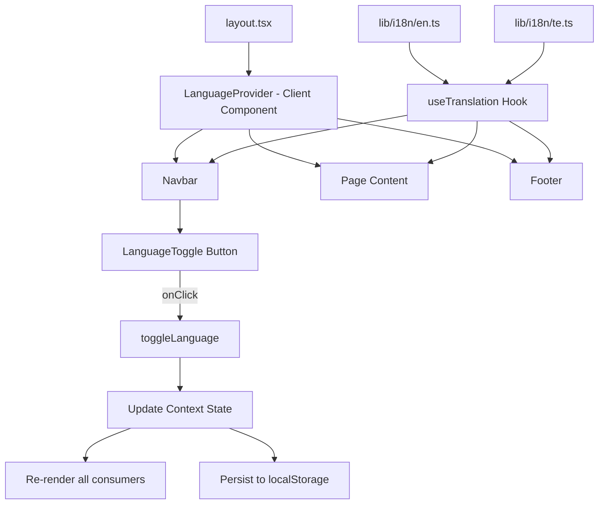

# Design Document: Telugu Language Toggle

## Overview

This feature adds bilingual support (English/Telugu) to the Pasumarthi Banquet Hall Next.js website. A language toggle button in the Navbar allows visitors to switch between English and Telugu instantly without page reloads. The implementation is entirely frontend — all translations are bundled as static TypeScript dictionaries, state is managed via React Context, and the user's language preference persists in localStorage.

### Key Design Goals

- Zero backend dependency — static i18n dictionaries bundled at build time
- Instant switching via React re-render (no page reload)
- Type-safe translations enforced by a shared TypeScript interface
- Telugu font support via `next/font/google` (Noto Sans Telugu)
- Accessible toggle button with proper ARIA attributes

## Architecture



### Data Flow

1. `LanguageProvider` wraps the app inside `layout.tsx` (client component boundary)
2. On mount, the provider reads localStorage for a saved language preference; defaults to `"en"`
3. Components call `useTranslation()` to get the current translation dictionary and a `toggleLanguage` function
4. When the user clicks the toggle, context state flips, localStorage updates, and all consuming components re-render with new strings
5. The HTML `lang` attribute updates dynamically to reflect the active language

### Component Boundary Strategy

Since Next.js App Router defaults to Server Components, the `LanguageProvider` creates a client component boundary. The approach:

- `layout.tsx` remains a server component for metadata
- A new `providers.tsx` client component wraps children with `LanguageProvider`
- Pages that need translation use `'use client'` or wrap translatable sections in client components
- Static metadata (SEO titles) remains in English (server-rendered)

## Components and Interfaces

### LanguageProvider (`lib/i18n/LanguageProvider.tsx`)

```typescript
'use client';
import { createContext, useContext, useState, useEffect, ReactNode } from 'react';
import type { Locale } from './types';

interface LanguageContextValue {
  locale: Locale;
  toggleLanguage: () => void;
}

const LanguageContext = createContext<LanguageContextValue | undefined>(undefined);

export function LanguageProvider({ children }: { children: ReactNode }) {
  const [locale, setLocale] = useState<Locale>('en');

  useEffect(() => {
    const saved = localStorage.getItem('locale') as Locale | null;
    if (saved === 'en' || saved === 'te') {
      setLocale(saved);
    }
  }, []);

  useEffect(() => {
    localStorage.setItem('locale', locale);
    document.documentElement.lang = locale;
  }, [locale]);

  const toggleLanguage = () => {
    setLocale((prev) => (prev === 'en' ? 'te' : 'en'));
  };

  return (
    <LanguageContext.Provider value={{ locale, toggleLanguage }}>
      {children}
    </LanguageContext.Provider>
  );
}

export function useLanguage() {
  const ctx = useContext(LanguageContext);
  if (!ctx) throw new Error('useLanguage must be used within LanguageProvider');
  return ctx;
}
```

### useTranslation Hook (`lib/i18n/useTranslation.ts`)

```typescript
import { useLanguage } from './LanguageProvider';
import { en } from './en';
import { te } from './te';
import type { TranslationDictionary } from './types';

const dictionaries: Record<string, TranslationDictionary> = { en, te };

export function useTranslation() {
  const { locale, toggleLanguage } = useLanguage();
  const t = dictionaries[locale] ?? dictionaries['en'];
  return { t, locale, toggleLanguage };
}
```

### LanguageToggle Button (inside Navbar)

```typescript
function LanguageToggle() {
  const { locale, toggleLanguage } = useTranslation();
  const label = locale === 'en' ? 'Switch to Telugu' : 'Switch to English';
  const text = locale === 'en' ? 'తె' : 'En';

  return (
    <button
      onClick={toggleLanguage}
      aria-label={label}
      className="px-2.5 py-1 text-gold border border-gold/30 hover:border-gold/60 
                 text-[13px] tracking-wide transition-all"
    >
      {text}
    </button>
  );
}
```

### Providers Wrapper (`app/providers.tsx`)

```typescript
'use client';
import { LanguageProvider } from '@/lib/i18n/LanguageProvider';

export function Providers({ children }: { children: React.ReactNode }) {
  return <LanguageProvider>{children}</LanguageProvider>;
}
```

## Data Models

### Translation Type System (`lib/i18n/types.ts`)

```typescript
export type Locale = 'en' | 'te';

export interface TranslationDictionary {
  navbar: {
    home: string;
    menu: string;
    events: string;
    bookNow: string;
    subtitle: string;  // "Banquet Hall · Khammam"
  };
  home: {
    heroWelcome: string;
    heroBanquetHall: string;
    heroTagline: string;
    heroBookBtn: string;
    heroMenuBtn: string;
    scroll: string;
    marquee: string[];
    aboutLabel: string;
    aboutHeading1: string;
    aboutHeading2: string;
    aboutHeading3: string;
    aboutDesc1: string;
    aboutDesc2: string;
    stats: { number: string; label: string }[];
    features: { title: string; desc: string }[];
    eventsLabel: string;
    eventsHeading1: string;
    eventsHeading2: string;
    eventsSubtitle: string;
    viewGallery: string;
    exploreAll: string;
    reviewsLabel: string;
    reviewsHeading: string;
    reviewsSubheading: string;
    ctaLabel: string;
    ctaHeading1: string;
    ctaHeading2: string;
    ctaDesc: string;
    ctaBtn: string;
  };
  menu: {
    label: string;
    heading: string;
    vegNote: string;
    menu1Label: string;
    menu1Count: string;
    menu1Desc: string;
    menu2Label: string;
    menu2Count: string;
    menu2Desc: string;
    menu2Extra: string;
    fullMenuLabel: string;
    fullMenuHeading: string;
    legend1: string;
    legend2: string;
    note: string;
    ctaLabel: string;
    ctaHeading1: string;
    ctaHeading2: string;
    ctaDesc: string;
    whatsappBtn: string;
    whatsappSubtext: string;
    callBtn: string;
    bookBtn: string;
    bookSubtext: string;
    items: Record<string, string>;  // English item name -> translated name
  };
  events: {
    heading: string;
    subtitle: string;
    categories: Record<string, {
      name: string;
      title: string;
      subtitle: string;
      quote: string;
    }>;
    galleryLabel: string;
    backToEvents: string;
  };
  book: {
    heading: string;
    description: string;
    labels: {
      fullName: string;
      phone: string;
      email: string;
      eventType: string;
      eventDate: string;
      guests: string;
      specialRequests: string;
    };
    placeholders: {
      fullName: string;
      phone: string;
      email: string;
      eventType: string;
      guests: string;
      specialRequests: string;
    };
    submitBtn: string;
    successMsg: string;
    callPrompt: string;
    timingsLabel: string;
    eventTypes: Record<string, string>;  // English event type -> translated
  };
  footer: {
    tagline: string;
    contactHeading: string;
    navigateHeading: string;
    navHome: string;
    navMenu: string;
    navEvents: string;
    navBook: string;
    navJustdial: string;
    whatsappBooking: string;
    copyright: string;
  };
}
```

### Translation File Structure

```
lib/i18n/
├── types.ts              # TranslationDictionary interface, Locale type
├── en.ts                 # English dictionary (implements TranslationDictionary)
├── te.ts                 # Telugu dictionary (implements TranslationDictionary)
├── LanguageProvider.tsx   # React Context provider
├── useTranslation.ts     # Consumer hook
└── index.ts              # Re-exports
```

### Font Configuration

Noto Sans Telugu loaded via `next/font/google` in `layout.tsx`:

```typescript
import { Noto_Sans_Telugu } from 'next/font/google';

const notoTelugu = Noto_Sans_Telugu({
  subsets: ['telugu'],
  variable: '--font-telugu',
  display: 'swap',
});
```

Applied conditionally when `locale === 'te'` via a CSS class on `<body>` or through the provider setting a data attribute (`data-locale="te"`) on the document element.

## Correctness Properties

*A property is a characteristic or behavior that should hold true across all valid executions of a system — essentially, a formal statement about what the system should do. Properties serve as the bridge between human-readable specifications and machine-verifiable correctness guarantees.*

### Property 1: Translation dictionary completeness

*For any* key path that exists in the English dictionary (`en.ts`), the Telugu dictionary (`te.ts`) SHALL have a corresponding value at the same key path, ensuring no missing translations.

**Validates: Requirements 3.3**

### Property 2: Language persistence round trip

*For any* valid locale value ("en" or "te"), storing it in localStorage and then reading it back SHALL return the same locale value — the persisted language preference is always recoverable.

**Validates: Requirements 1.4, 1.5**

### Property 3: Toggle is an involution (double toggle restores state)

*For any* starting locale, toggling the language twice SHALL return the locale to its original value.

**Validates: Requirements 1.2, 2.4**

### Property 4: Fallback to English for missing keys

*For any* translation key that is present in the English dictionary but missing or undefined in the Telugu dictionary, the system SHALL return the English value rather than undefined or an error.

**Validates: Requirements 3.5**


## Error Handling

| Scenario | Handling |
|----------|----------|
| localStorage unavailable (private browsing) | Catch the error silently; default to `"en"`, skip persistence |
| Invalid locale value in localStorage | Ignore the stored value; default to `"en"` |
| Missing translation key in active dictionary | Fall back to the English (`en`) value for that key |
| Telugu font fails to load | Browser falls back to system Telugu font; text still renders |
| Context used outside Provider | `useLanguage()` throws an error with a developer-friendly message |

## Testing Strategy

### Unit Tests (Example-Based)

- **LanguageProvider**: Verify default locale is `"en"` on first load
- **Toggle behavior**: Click toggle → locale flips from `"en"` to `"te"` and vice versa
- **localStorage integration**: Verify locale is written on change, read on mount
- **Navbar rendering**: Toggle button shows "తె" when English, "En" when Telugu
- **Accessibility**: Toggle button has correct `aria-label` for each state
- **Edge cases**: Invalid localStorage values, missing localStorage API

### Property-Based Tests

Using a property-based testing library (e.g., `fast-check`) to validate the correctness properties:

- **Dictionary completeness**: Generate all key paths from `en.ts`, verify each exists in `te.ts`
- **Persistence round trip**: For any locale in `['en', 'te']`, `localStorage.setItem` → `getItem` returns the same value
- **Toggle involution**: For any starting locale, `toggle(toggle(locale)) === locale`
- **Fallback behavior**: For any key path, if Telugu value is removed, lookup returns English value
Each property test runs a minimum of 100 iterations. Tests are tagged:
- **Feature: telugu-language-toggle, Property 1: Translation dictionary completeness**
- **Feature: telugu-language-toggle, Property 2: Language persistence round trip**
- **Feature: telugu-language-toggle, Property 3: Toggle is an involution**
- **Feature: telugu-language-toggle, Property 4: Fallback to English for missing keys**

### Integration Tests

- Full page render in English → toggle → verify visible text changed to Telugu
- Navigation between pages with Telugu active → content stays in Telugu
- Browser refresh with localStorage set to `"te"` → page renders in Telugu

### Manual / Visual Testing

- Telugu glyph rendering across Chrome, Firefox, Safari, Edge
- Font sizing legibility for Telugu script
- Mobile viewport: toggle button placement in hamburger menu
- Screen reader announcement of toggle button state
